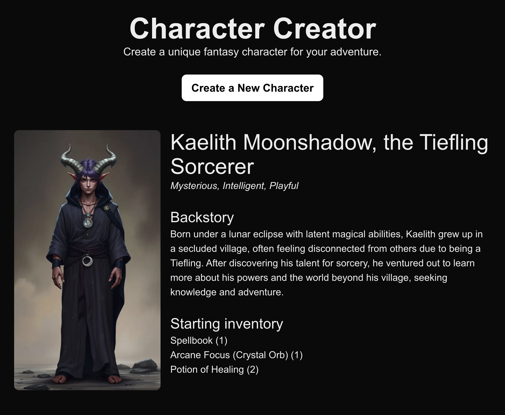

# Character Creator LLM App

This is the app to go with "Best Practices for Building LLM-Powered Web Apps"

- Watch the [YouTube video](https://youtu.be/kRwSYr6L6XY)
- Read the [Medium article](https://medium.com/@tommywilczek/how-to-architect-llm-powered-web-apps-99e02fa643e9)

## Topics covered

- **LLM Orchestration** (how to coordinate AI calls in your app's workflow) - start simple and let it grow as your app grows in complexity.
- **Separate the responsibilities of AI calls** - instead of having one big LLM call that returns a lot of different data, we can split them up into multiple calls that each do one thing.
- **Layers of abstraction** within the AI calls to make your code easier to re-use and maintain.
- **AI adherence to return types** without needing to change the prompt, using AI SDK and Zod.



## Getting Started

First, input your API keys in the `.env.local` file:

```text
OPENAI_API_KEY=
REPLICATE_API_TOKEN=
```

Run the development server:

```bash
npm run dev
# or
yarn dev
# or
pnpm dev
# or
bun dev
```

Open [http://localhost:3000](http://localhost:3000) with your browser to see the result.
